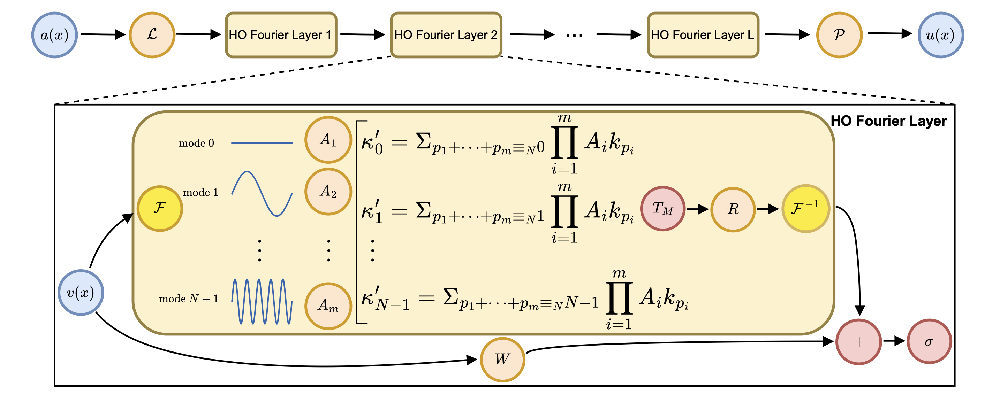
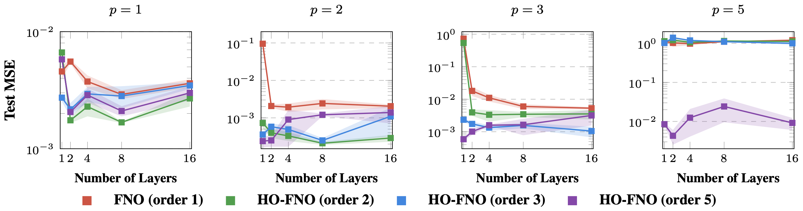
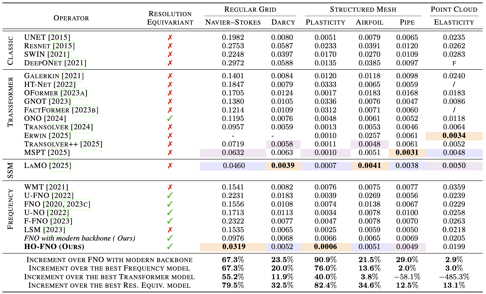
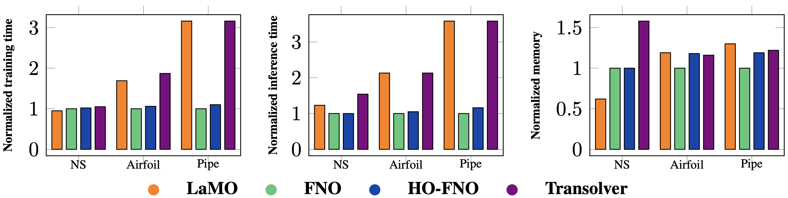

<div align="center">
  
# [Higher-Order Fourier Neural Operator: Explicit Mode Mixer for Nonlinear PDEs](https://img.shields.io/badge/License-MIT-yellow.svg)
[](https://github.com)
[](https://arxiv.org)

**[Alex Colagrande](), [Paul Caillon](https://dauphine.psl.eu/recherche/cvtheque/profil/caillon-paul), [Eva Feillet](https://evajf.github.io/) and [Alexandre Allauzen](https://allauzen.github.io/)** <br>

**[MILES Team](https://www.lamsade.dauphine.fr/wp/miles/) @ [LAMSADE](https://www.lamsade.dauphine.fr/) @ [Paris Dauphine-PSL](https://dauphine.psl.eu/)** <br>

> This repository contains the official implementation of our [HO-FNO](https://arxiv.org):

A simple extension of the Fourier Neural Operator that bridges the gap with transformer models by explicitly incorporating the polynomial mode interactions observed in nonlinear PDEs, while preserving FNO’s efficiency.

<p align="center">
  
  <br><br>
  <b>Figure 1.</b> Overview of HO-FNO.
</p>

## A single HO-FNO layer is worth 16 FNO layers: Poisson Equation with Polynomial source
A single layer of HO-FNO outperforms FNO models with 16 layers (equivalently, with 16 times more parameters) by up to two orders of magnitude in mean squared error.

> You can directly run these experiments from the notebook polynomial_poisson_demo.ipynb

<p align="center">
  
  <br><br>
  <b>Figure 2.</b> Test MSE as a function of the number of layers on the Polynomial-Source Poisson datasets.
</p>

## Results on Standard Benchmarks
Across standard benchmarks, HO-FNO is the only spectral neural operator that bridges, and sometimes surpasses, the gap with transformer and state-space models.

<p align="center">
  
  <br><br>
  <b>Figure 3.</b> Results across standard datasets.
</p>

## Efficiency Analysis
Our proposed HO-FNO adds negligible number of parameters, inference/training time and peak memory usage to standard FNO, remaining therefore more efficient than alternatives such as many transformers and state space models.

<p align="center">
  
  <br><br>
  <b>Figure 4.</b> Efficiency Analysis.
</p>

## Instructions to run the code

1. We reccomend installing Python 3.13.5. For convenience, you can install all the required dependencies via the following command.

```bash
pip install -r requirements.txt
```

2. Prepare Data. You can obtain experimental datasets from the following links (Download).

| Dataset       | Task                                    | Geometry        | Link                                                         |
| ------------- | --------------------------------------- | --------------- | ------------------------------------------------------------ |
| Elasticity    | Estimate material inner stress          | Point Cloud     | [[Google Cloud]](https://drive.google.com/drive/folders/1YBuaoTdOSr_qzaow-G-iwvbUI7fiUzu8) |
| Plasticity    | Estimate material deformation over time | Structured Mesh | [[Google Cloud]](https://drive.google.com/drive/folders/1YBuaoTdOSr_qzaow-G-iwvbUI7fiUzu8) |
| Navier-Stokes | Predict future fluid velocity           | Regular Grid    | [[Google Cloud]](https://drive.google.com/drive/folders/1UnbQh2WWc6knEHbLn-ZaXrKUZhp7pjt-) |
| Darcy         | Estimate fluid pressure through medium  | Regular Grid    | [[Google Cloud]](https://drive.google.com/drive/folders/1UnbQh2WWc6knEHbLn-ZaXrKUZhp7pjt-) |
| AirFoil       | Estimate airflow velocity around airfoil | Structured Mesh | [[Google Cloud]](https://drive.google.com/drive/folders/1YBuaoTdOSr_qzaow-G-iwvbUI7fiUzu8) |
| Pipe          | Estimate fluid velocity in a pipe       | Structured Mesh | [[Google Cloud]](https://drive.google.com/drive/folders/1YBuaoTdOSr_qzaow-G-iwvbUI7fiUzu8) |

3. Train and evaluate the model. You can run the bash scripts from the folder `./scripts/` or directly the python scripts.
    
Note: You must change the argument `--data-path` in the above script files to your dataset path.

## BibTeX

If you find our work relevant to your research or found it otherwise useful, please consider citing us

```
```

## Contact
If you have any questions, any ideas for future works based on HO-FNO or you just would like to discuss about related topics, please feel free to contact me at:

Alex Colagrande: alex.colagrande@dauphine.psl.eu

I would be happy to discuss about it :)

## Acknowledgement

We appreciate the following GitHub repos a lot for their valuable code base or datasets on which we have built our code:

1) https://github.com/neuraloperator/neuraloperator

2) https://github.com/neuraloperator/Geo-FNO
3) https://github.com/M3RG-IITD/LaMO

4) https://github.com/thuml/Transolver/tree/main